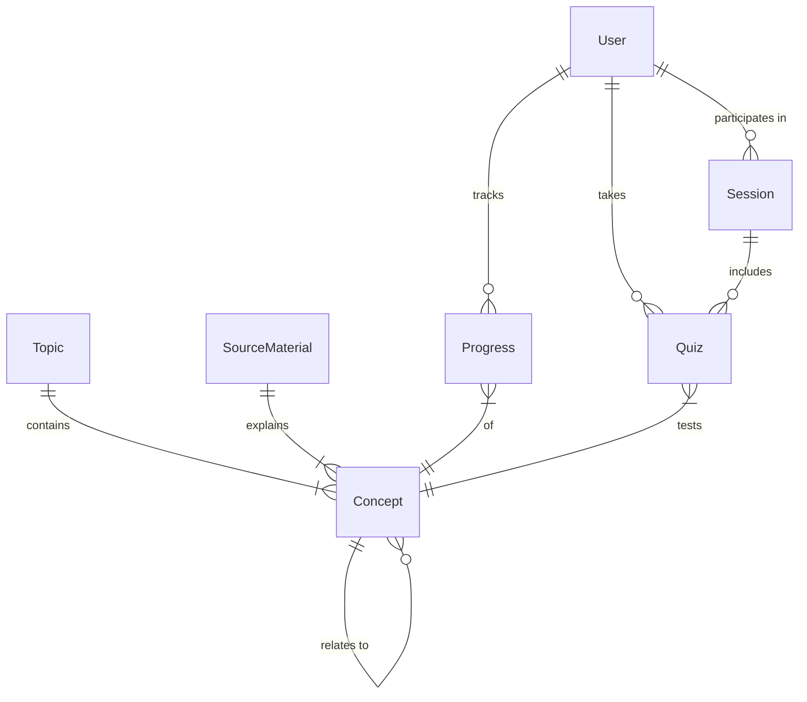

---
stepsCompleted:
  - step-01-init
  - step-02-discovery
  - step-02b-vision
  - step-02c-executive-summary
  - step-03-success
  - step-04-journeys
  - step-05-domain
  - step-06-innovation
  - step-07-project-type
  - step-08-scoping
  - step-09-functional
  - step-10-nonfunctional
  - step-11-polish
inputDocuments:
  - plan.md
documentCounts:
  briefCount: 1
  researchCount: 0
  brainstormingCount: 0
  projectDocsCount: 0
workflowType: prd
classification:
  projectType: web_app
  domain: edtech
  complexity: high
  projectContext: greenfield
---

# Product Requirements Document - Mentor Agent

**Author:** Will
**Date:** 2026-02-19

```
███╗   ███╗███████╗███╗   ██╗████████╗ ██████╗ ██████╗      █████╗  ██████╗ ███████╗███╗   ██╗████████╗
████╗ ████║██╔════╝████╗  ██║╚══██╔══╝██╔═══██╗██╔══██╗    ██╔══██╗██╔════╝ ██╔════╝████╗  ██║╚══██╔══╝
██╔████╔██║█████╗  ██╔██╗ ██║   ██║   ██║   ██║██████╔╝    ███████║██║  ███╗█████╗  ██╔██╗ ██║   ██║   
██║╚██╔╝██║██╔══╝  ██║╚██╗██║   ██║   ██║   ██║██╔══██╗    ██╔══██║██║   ██║██╔══╝  ██║╚██╗██║   ██║   
██║ ╚═╝ ██║███████╗██║ ╚████║   ██║   ╚██████╔╝██║  ██║    ██║  ██║╚██████╔╝███████╗██║ ╚████║   ██║   
╚═╝     ╚═╝╚══════╝╚═╝  ╚═══╝   ╚═╝    ╚═════╝ ╚═╝  ╚═╝    ╚═╝  ╚═╝ ╚═════╝ ╚══════╝╚═╝  ╚═══╝   ╚═╝   
```

## 1. Executive Summary

Mentor Agent 是一款专为终身学习者（如网络工程师、编程爱好者等）打造的个性化 AI 学习导师，旨在解决传统学习方式中缺乏互动、无法追踪进度、难以发现知识盲区的问题。不同于被动的视频观看或书籍阅读，Mentor Agent 提供了一个主动的、苏格拉底式的学习环境。它结合了 RAG (检索增强生成) 技术与本地知识库，能够根据用户的学习进度和薄弱环节，动态调整教学策略。

### Product Vision
最终愿景是构建一个**内容无关 (Content-Agnostic) 的通用导师**。无论用户上传的是网络工程手册、编程指南还是历史书籍，Agent 都能适应并提供像真人导师一样的陪伴式学习体验。它让用户感觉**身边就像有一个随时可以交流的 Mentor 一样**，随时待命解决疑惑、查漏补缺。

### What Makes This Special
Mentor Agent 的核心差异化在于**基于用户自选材料的 RAG** 与 **长期记忆**。
*   **Custom RAG vs. Standard Chat:** 与 ChatGPT 或 Claude 等通用对话窗口不同，它们缺乏针对用户特定学习材料的上下文。Mentor Agent 允许用户上传指定的书籍和文档，提供高度定制化的辅助。
*   **薄弱点追踪：** 它不仅仅回答问题，更能记住用户在哪些概念上频繁出错，并针对性地生成练习题。
*   **知识关联：** 它能够跨越单本书籍的限制，主动关联不同来源的知识点，帮助用户构建网状的知识体系。

### Project Classification
*   **项目类型：** Web Application (Open WebUI) + API Backend (Agent Service)
*   **领域：** EdTech (技术教育/职业培训)
*   **复杂度：** High (涉及 Agent 编排、RAG、多模态交互、状态追踪)
*   **项目背景：** Greenfield (全新开发)

## 2. Success Criteria

### User Success
*   **知识盲区消除:** 用户能够通过 Agent 的针对性提问，发现并补全至少 80% 的知识盲区（通过 Quiz 正确率衡量）。
*   **学习效率提升:** 减少在“不知道学什么”或“重复学习已掌握内容”上浪费的时间。
*   **实践结合:** 能够成功运行 Agent 生成的针对特定环境（如 Homelab）的场景题。
*   **随时可用的 Mentor:** 在遇到问题时，能在 1 分钟内获得基于上下文的准确指导，感觉像是有专家在旁。

### Business/Personal Success
*   **知识体系构建:** 在 Notion 中自动生成的学习笔记和知识图谱能够清晰反映出用户的技能树增长。
*   **长期记忆形成:** 通过 Anki 卡片的自动生成和复习，关键概念的长期记忆保留率显著提高。

### Technical Success
*   **RAG 准确性:** 检索到的上下文相关性 > 90%，减少幻觉。
*   **工具调用稳定性:** Agent Service 能正确调用所有工具 (Quiz, Progress, Graph, Notion, Anki)，错误率 < 5%。
*   **响应速度:** 普通对话响应 < 3秒，RAG 检索响应 < 10秒 (Plan Generation < 30s)。

### Measurable Outcomes
*   **日活 (Daily Active Usage):** 每天与 Mentor 交互至少 15 分钟。
*   **Anki 卡片生成量:** 每周自动生成并同步至少 20 张高质量 Anki 卡片。

## 3. Product Scope

### MVP - Minimum Viable Product (v1)
*   **核心功能:** 基于 Open WebUI 的对话界面，支持用户上传 PDF 书籍进行 RAG 检索。
*   **Agent 能力:** 具备 Quiz 生成、评分、进度追踪、前置知识检查功能。
*   **Teach Me Mode:** 支持类比解释 (Analogies)、前置知识检查 (Prerequisite Check)、知识关联 (Contextual Linking)。
*   **集成:** SQLite 数据库存储进度和图谱，Notion API 自动生成总结。
*   **部署:** Docker Compose 本地部署。
*   **验证场景:** 网络工程领域 (Nornir, NAPALM, T7910 context) 作为首个测试用例，但架构保持通用。

### Growth Features (Post-MVP / v2)
*   **移动端:** Chatbox + Cloudflare Tunnel 接入，支持随时随地学习。
*   **Anki 集成:** 自动生成并同步 Anki 卡片 (v1 MVP 仅通过 API 生成，v2 深度集成同步)。
*   **场景生成:** 深度结合用户环境（如 Homelab）的实战场景题。
*   **Gamification:** 成就系统 (Badges, Streaks) 增强用户粘性。
*   **多领域扩展:** 支持上传任意领域的书籍（如烹饪、历史、编程），验证通用性。

### Vision (Future)
*   **全能 Mentor:** 一个通用的、自适应的 AI 导师，能够根据提供的任何知识库进行教学，不仅仅局限于技术领域。
*   **主动学习规划:** 基于用户目标和当前状态，自动规划完整的学习路径，并根据进度动态调整。

## 4. User Journeys

### Journey 1: The "Teach Me" Moment (Concept Learning)
**User:** Alex, a network engineer transitioning to automation.
**Context:** Alex is reading a book on Python but stuck on the concept of "Decorators". He knows the syntax but doesn't get *why* or *when* to use them.

*   **Trigger:** Alex types: "Teach me about Decorators from the Python book I uploaded. I don't get it."
*   **Prerequisite Check:** Agent (internal thought): "Check Knowledge Graph. Does Alex know functions and first-class objects? Yes."
*   **Explanation (Direct & Analogical):** Agent explains: "Think of a decorator like a wrapper around a gift. The gift (your function) stays the same, but the wrapper (decorator) adds something extra, like a bow or a card, before you hand it over. In code, it adds behavior before or after the function runs without changing the function itself."
*   **Contextual Link:** Agent adds: "Remember when we talked about `logging` in your Nornir scripts last week? You can use a decorator to automatically log every time a function starts and stops, instead of writing `print` statements inside every single function."
*   **Socratic Check:** Agent asks: "Based on that, if you wanted to measure how long each of your script tasks takes, how might a decorator help?"
*   **Outcome:** Alex has an "Aha!" moment, linking the abstract concept to a concrete pain point he has (logging/timing scripts).

### Journey 2: The "Targeted Practice" Loop (Weakness Remediation)
**User:** Sarah, preparing for a certification.
**Context:** Sarah keeps getting BGP path selection questions wrong.

*   **Trigger:** Sarah says: "I need to fix my BGP path selection. Grill me."
*   **System Action:** Agent scans `progress` table. "Sarah struggles specifically with `MED` vs `Local Preference`."
*   **Action:** Agent generates a scenario: "You have two upstream providers. Provider A sends `MED 50`, Provider B sends `MED 100`. But you configured `Local Preference 200` on the route from Provider B. Which path is chosen and why?"
*   **User Response:** Sarah answers: "Provider A because lower MED is better."
*   **Correction & Teaching:** Agent corrects: "Not quite. Remember the BGP order of operations? `Local Preference` is checked *before* `MED`. Since you set Local Pref on B on 200 (default is 100), B wins immediately. MED isn't even compared yet."
*   **Reinforcement:** Agent updates the Knowledge Graph to mark this specific comparison logic as weak and schedules a spaced repetition card for tomorrow via Anki.

### Journey 3: The "New Domain" Ingestion (Content Agnostic)
**User:** Mike, a hobbyist chef.
**Context:** Mike uploads "The Science of Cooking.pdf".

*   **Trigger:** Mike uploads the PDF.
*   **System Action:** RAG processes the file. Agent builds a new branch in the Knowledge Graph for "Cooking".
*   **User Query:** "Teach me about the Maillard reaction."
*   **Agent Response:** "The Maillard reaction is a chemical reaction between amino acids and reducing sugars that gives browned food its distinctive flavor. Think of it like..." (Proceeds with "Teach Me" flow in a completely new domain).

### Journey Requirements Summary
*   **Teach Me Mode:** 需要具备解释复杂概念、检查前置知识、生成类比的能力。
*   **Prerequisite Checking:** 系统必须能够查询用户的已知概念图谱。
*   **Contextual Linking:** 系统必须能够关联用户已知的旧知识点。
*   **Weakness Remediation:** 系统必须能够追踪特定概念的错误率，并生成针对性练习。
*   **Content Agnostic:** 系统架构必须支持多领域知识库的动态加载和处理。

## 5. Domain Modeling

### Core Entities

1.  **User (用户)**
    *   代表学习者。
    *   属性：ID, Name, CurrentContext (e.g., "Network Engineering", "Cooking"), SkillLevel。
2.  **Topic (主题)**
    *   代表一个大的学习领域。
    *   属性：Name (e.g., "Python", "BGP"), Domain (e.g., "Programming", "Networking")。
3.  **SourceMaterial (学习资料)**
    *   代表用户上传的书籍或文档。
    *   属性：Title, Type (PDF/Web), ContentVector (RAG Index ID)。
    *   关系：属于一个或多个 `Topic`。
4.  **Concept (概念)**
    *   代表最小的知识单元 (e.g., "Decorator", "Maillard Reaction")。
    *   属性：Name, Definition, Difficulty。
    *   关系：属于 `Topic`，来自 `SourceMaterial`。
    *   **关键关系：** `Concept` A *has prerequisite* `Concept` B (依赖关系，用于 Teach Me 模式的前置检查)。
5.  **Progress (进度)**
    *   追踪用户对特定概念的掌握程度。
    *   属性：MasteryLevel (0-100), LastReviewedAt, ErrorCount。
    *   关系：连接 `User` 和 `Concept`。
6.  **Quiz (测验)**
    *   代表一次互动的问答。
    *   属性：Question, Answer, UserAnswer, Score, Feedback。
    *   关系：针对特定的 `Concept`。
7.  **Session (会话)**
    *   代表一次学习过程。
    *   属性：Summary (Notion Content), StartedAt, EndedAt。

### Entity Relationships



## 6. Innovation & Risks

### Core Innovation

1.  **"Teach Me" Mode (苏格拉底式教学):**
    *   **创新点:** 从“被动问答”转变为“主动教学”。利用 Knowledge Graph 的前置关系，Agent 能够像老师一样先检查基础，再用类比解释新概念。
    *   **价值:** 降低了学习门槛，解决了“看不懂书”的痛点。
2.  **Context-Aware RAG (上下文感知 RAG):**
    *   **创新点:** RAG 检索不再是孤立的，而是结合了用户的 `SkillLevel` 和 `Progress`。
    *   **价值:** 同样的查询（如 "BGP"），对初学者和专家返回不同深度的内容。
3.  **Cross-Document Linking (跨文档关联):**
    *   **创新点:** 自动发现并提示用户：“这个概念你在《Python 编程》里也见过类似的...”。
    *   **价值:** 帮助用户打破知识孤岛，构建网状知识体系。

### Risks & Mitigations

#### Technical Risks
*   **Risk 1: Open WebUI Knowledge API Limitations**
    *   **描述:** 项目完全依赖 Open WebUI 的内置 Knowledge 功能进行 RAG 检索。如果其 API 不支持足够细粒度的查询（如返回相似度分数、元数据过滤），可能影响回答质量。
    *   **缓解:** 详细调研 Open WebUI 的 API 能力。如有必要，考虑在 Agent Service 中实现备用的轻量级检索逻辑 (Post-filtering)。
*   **Risk 2: RAG 幻觉 (Hallucination)**
    *   **描述:** Agent 可能会一本正经地胡说八道，特别是在缺乏上下文时。
    *   **缓解:** 严格限制 RAG 的检索阈值。在 "Teach Me" 模式下，强制要求 Agent 在回答中引用原文片段作为依据。

#### Product Risks
*   **Risk 3: 用户粘性 (User Disengagement)**
    *   **描述:** 刚开始很新鲜，但聊久了发现 Agent 说话太机械，用户失去兴趣。
    *   **缓解:** 引入“个性化语气”配置 (e.g., 严厉的导师、幽默的伙伴)。在 v2 引入 Gamification (成就系统)。
*   **Risk 4: 学习路径过于僵化 (Rigid Learning Path)**
    *   **描述:** 自动生成的目录结构可能不符合用户的实际认知顺序。
    *   **缓解:** 允许用户手动调整学习路径 (Drag & Drop)，或选择“自由探索模式”跳过路径限制。

## 7. Project Architecture

### Project Type
*   **Type:** Web Application + API Backend
*   **Context:** Greenfield (全新开发)

### Architecture Pattern: Agent-as-LLM-Proxy

Agent Service 对外暴露 OpenAI 兼容 API（`/v1/chat/completions`），让 Open WebUI 将其视为一个"模型"。Agent Service 内部维护完整的 Tool Use 循环，通过 LiteLLM 调用云端 LLM 完成推理。

**数据流：**
```
User → Open WebUI → Agent Service (FastAPI, OpenAI 兼容 API)
                         ↓
                    LiteLLM (litellm-claude-code, Claude Max OAuth) → Claude (云端)
                         ↓
                    Claude 返回 tool_use 指令
                         ↓
                    Agent Service 执行工具 (SQLite, Open WebUI RAG, Notion, Anki...)
                         ↓
                    工具结果回传 Claude → 循环直到生成最终回复
                         ↓
                    Agent Service 以 SSE Streaming 格式返回给 Open WebUI
```

Open WebUI 完全感知不到后面的 Tool Use 循环，只收到最终的文本回复。

### Tech Stack Constraints
*   **Frontend:** Open WebUI (Existing)，配置 Agent Service 作为 OpenAI API 端点
*   **Backend / Agent Service:** FastAPI (Python)，实现 OpenAI 兼容 API + SSE Streaming
*   **Database:** SQLite (for Progress, Graph, User data)
*   **Vector DB:** Open WebUI Built-in (e.g., ChromaDB)
*   **LLM Access:** 通过 `litellm-claude-code` 代理访问云端 LLM（Claude Max 订阅 OAuth），用户需自备订阅
*   **Deployment:** Docker Compose (4 services: agent-service, open-webui, litellm-claude-code, anki)

### Integration Points
*   **Open WebUI → Agent Service:** Open WebUI 配置 `http://agent-service:8100/v1` 作为 OpenAI API 端点（同一 Docker 网络）
*   **Agent Service → LiteLLM:** Agent Service 调用 `http://litellm-claude-code:4000/v1` 进行 LLM 推理
*   **Agent Service → Open WebUI RAG:** `search_knowledge_base` 工具反向调用 Open WebUI 的检索 API 查询 ChromaDB
*   **Agent Service → Notion API:** 会话结束时推送学习总结
*   **Agent Service → AnkiConnect:** Homelab Linux 容器运行 Anki + AnkiConnect 插件（端口 8765），通过 AnkiWeb 同步到手机

### Key Technical Decisions
*   **Agent-as-LLM-Proxy:** Agent Service 伪装为 LLM，Open WebUI 无需任何定制即可接入。未来手机端（Chatbox）也可直接对接同一 Agent Service。
*   **Tool Use Loop:** Agent Service 独立维护 Tool Use 循环，Open WebUI 仅作为 UI 入口。
*   **State Management:** 所有的用户进度和知识图谱存储在本地 SQLite，确保数据隐私和迁移便利性。
*   **RAG 反向调用:** Agent 通过 Open WebUI API 检索向量知识库，而非自建独立的 RAG pipeline。

### Known Limitations (已知取舍)
*   **Open WebUI 知识库选择界面不可用：** RAG 检索由 Agent Service 内部工具负责，Open WebUI 的手动知识库选择功能失效。替代方案：Agent 自动判断或用户在对话中指定（"从 BGP 相关的书里找"）。
*   **Open WebUI 模型切换不可用：** Open WebUI 中的"模型"实际是 Agent Service，无法通过 UI 切换底层 LLM。需在 Agent Service 配置中指定。

## 8. MVP Scope Definition

### MVP Scope (v1) Definition

#### 1. Core Learning Loop (核心学习闭环)
*   **Source Management:**
    *   上传 PDF 书籍到 Open WebUI。
    *   Agent 解析目录结构（依赖 Open WebUI 的解析能力）。
*   **Learning Path Generation (学习计划生成):**
    *   Agent 扫描上传资料的目录 (TOC)，生成结构化的学习计划并存入数据库。
    *   用户可以随时查询 "What's next?" 并查看当前进度。
*   **Concept Explanation (Teach Me):**
    *   用户提问：“Teach me [concept]”。
    *   Agent 查询 Knowledge Graph 检查前置知识。
    *   Agent 结合 RAG 检索结果，用类比法解释概念。
*   **Assessment (Quiz):**
    *   Agent 生成单选题/简答题。
    *   用户作答。
    *   Agent 评分并提供解析。

#### 2. Progress & State Tracking (进度与状态追踪)
*   **Database:** SQLite `progress` 表。
*   **Logic:**
    *   记录每个 Concept 的 `mastery_level` (0-100)。
    *   记录 Quiz 的历史记录和错误点。
*   **Visualization:** 简单的文本报告 ("You have mastered 5/10 concepts in Chapter 1")。

#### 3. Knowledge Graph (知识图谱)
*   **Database:** SQLite `knowledge_graph` 表。
*   **Logic:**
    *   自动提取 Concept 之间的关系 (Prerequisite, Related)。
    *   Agent 在解释时主动引用关联节点。

#### 4. Outputs & Integration (输出与集成)
*   **Notion Summary:**
    *   会话结束时，自动生成 Summary 并推送到 Notion Database。
*   **Anki Integration:**
    *   识别关键知识点，调用 AnkiConnect API 创建卡片。
    *   主要方案：Homelab 运行 Anki Linux 容器 + AnkiConnect 插件（端口 8765），Agent Service 直接推送卡片，通过 AnkiWeb 同步到手机。

#### 5. Tech Constraints (技术约束)
*   **Frontend:** 仅使用 Open WebUI 原生界面，不开发独立前端。
*   **Backend:** FastAPI 提供 Agent Service，实现 OpenAI 兼容 API + SSE Streaming，处理 Tool Calls。
*   **Deployment:** Docker Compose 一键拉起 (Open WebUI + Agent Service + LiteLLM + Anki)，共 4 个容器服务。

#### 6. Known Limitations (已知取舍)
*   **Open WebUI 知识库选择界面不可用：** RAG 检索由 Agent Service 内部工具负责。替代方案：Agent 自动判断或用户在对话中指定。
*   **Open WebUI 模型切换不可用：** "模型"实际是 Agent Service，底层 LLM 切换需在 Agent Service 配置中完成。

## 9. Functional Requirements

### 1. Learning Plan Generator (学习计划生成器)
*   **功能描述:** 根据用户上传的文档生成结构化学习计划。
*   **输入:** 用户上传的 PDF 文档 ID。
*   **核心逻辑:**
    1.  调用 Open WebUI RAG 接口获取文档目录 (TOC) 或开头部分的结构化文本。
    2.  LLM 分析目录结构，提取章节 (Chapter) 和小节 (Section)。
    3.  转换为标准 JSON 格式：`[{chapter: "1. Intro", sections: ["1.1 Python Basics", "1.2 Variables"]}]`。
    4.  存入 SQLite `topics` 和 `concepts` 表。
*   **输出:** 结构化的 JSON 学习计划，可在前端以列表或树形结构展示。
*   **交互:** 用户可查询计划详情，系统可基于计划推荐下一步学习内容。

### 2. Progress Tracker (进度追踪器)
*   **功能描述:** 追踪并更新用户的学习进度和掌握情况。
*   **状态定义:** 每个 Concept 有 `status` (Not Started, In Progress, Mastered) 和 `mastery_score` (0-100)。
*   **更新触发:**
    *   **Teach Me:** 完成一次概念讲解 -> 状态变为 "In Progress"。
    *   **Quiz:** 答对 -> `mastery_score` +10；答错 -> `mastery_score` -5。
*   **数据展示:** 提供学习计划的进度概览 (e.g., "Chapter 1: 80% Completed")。
*   **UI Implementation:** Rendered as ASCII/Markdown progress bars within chat messages.

### 3. Quiz Engine (测验引擎)
*   **功能描述:** 动态生成测验题目并评分。
*   **题目生成 (Generation):**
    *   **Context:** 基于当前选中的 Concept 和用户的历史错误点。
    *   **RAG:** 检索相关段落作为出题依据。
    *   **Prompt:** "Generate a multiple-choice question about [Concept] suitable for a [Beginner]. Focus on [Weakness] if exists."
*   **评分 (Grading):**
    *   LLM 接收用户答案，对比标准答案。
    *   输出 JSON: `{correct: boolean, explanation: "...", related_concepts: [...]}`。
*   **反馈机制:** 实时显示解析，并提供 "Explain More" 选项深入讲解。

### 4. "Teach Me" Orchestrator ("教我" 编排器)
*   **功能描述:** 处理用户的学习请求，提供结构化讲解。
*   **意图识别:** 识别用户指令 "Teach me X"。
*   **前置检查 (Prereq Check):** 查询 Graph 检查 X 的前置节点是否已掌握。
    *   若未掌握，提示："你可能需要先了解 Y，是否先讲 Y？"
*   **内容生成 (Delivery):**
    *   生成解释文本 (包含类比)。
    *   关联 RAG 来源 ("From Book: Python 101, Page 20")。
    *   关联旧知识 ("这和你已知的 Z 很像")。

### 5. System Prompt Strategy (系统提示词策略)
*   **Persona:** "You are an expert mentor who guides, not just answers. You use analogies from the user's known domains (e.g., Cooking) to explain new concepts (e.g., Networking)."
*   **Instruction Tuning:**
    *   Always check prerequisites before explaining complex topics.
    *   Use the `knowledge_graph` tool to find connections.
    *   When the user makes a mistake, ask a guiding question instead of giving the answer directly.
    *   Always verify if RAG content is sufficient; if not, state limitations clearly.

## 10. Non-Functional Requirements

### 1. Performance (性能)
*   **Response Latency:**
    *   Simple Chat: < 3 秒 (不含 RAG)。
    *   RAG Query: < 10 秒 (含检索和生成)。
    *   Plan Generation: < 30 秒 (取决于文档大小，需显示进度条)。
*   **Concurrency:** 单用户本地使用，无高并发要求。
*   **Resource Usage:**
    *   Idle Memory: < 2GB (LLM 推理在云端，本地仅运行 Agent Service 和 Open WebUI)。
    *   Disk Space: < 1GB (不含用户上传的 PDF 和 Open WebUI 数据卷)。

### 2. Reliability & Availability (可靠性与可用性)
*   **Uptime:** 依赖于本地 Docker 环境。Agent Service 应具备自动重启策略 (`restart: unless-stopped`)。
*   **Data Integrity:** SQLite 数据库需每日自动备份 (通过简单的 Cron Job 或应用内逻辑)。
*   **Error Handling:**
    *   RAG 检索失败时，应优雅降级为“未找到相关信息”，而不是报错。
    *   外部 API (Notion/Anki) 调用失败时，应存入重试队列，不阻塞主流程。

### 3. Security & Privacy (安全与隐私)
*   **Data Privacy:** 所有用户上传的 PDF、进度数据、知识图谱均存储在**本地**。LLM 推理通过云端 API（Anthropic / OpenAI），对话内容会发送到云端。
*   **Secrets Management:** 敏感凭证必须通过环境变量 (`.env`) 注入，严禁硬编码。包括：
    *   `CLAUDE_TOKEN`：Claude Max 订阅 OAuth Token（通过 `claude setup-token` 生成）
    *   `LITELLM_KEY`：LiteLLM 本地通信密钥（自设）
    *   `OPENWEBUI_API_KEY`：Open WebUI 生成的 API Key（供 Agent Service 调用 RAG API）
    *   `NOTION_TOKEN` / `NOTION_DB_ID`：Notion 集成凭证
*   **Network:** Agent Service 监听本地端口 8100，不直接暴露于公网（v2 手机端通过 Cloudflare Tunnel 接入）。

### 4. Maintainability (可维护性)
*   **Code Structure:** 后端采用模块化架构 (Routers, Services, Repositories)。
*   **Logging:** 关键操作 (Tool Call, Error) 需记录详细日志，便于排查。
*   **Configuration:** 所有可配置项 (如 RAG Top-K, LLM Model Name) 需提取到配置文件或环境变量。
