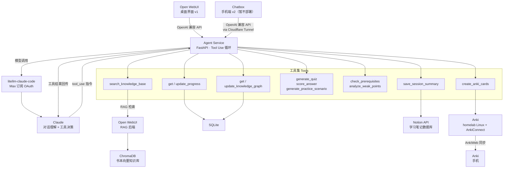

# 个人 AI Mentor Agent 方案 v0.6

**目标**：构建一个真正的 agent，不只是聊天界面，能主动规划学习路径、追踪进度、生成场景题、分析薄弱点。

**实现阶段**：v1 以桌面端（Open WebUI）为主，手机端（Chatbox）为 v2 工作。

---

## 架构总览



Open WebUI 指向 Agent Service，完全感知不到背后的 tool use 循环。
手机端（Chatbox）作为 v2 接入，架构相同，无需改动 Agent Service。

---

## 完整功能集

### 核心功能（v1）

**Quiz 生成与评分**
- 根据当前学习 topic 自动生成题目
- 支持难度分级（easy / medium / hard）
- 评分并给出详细反馈，不只是对错

**学习路径规划**
- 根据书本目录生成结构化学习路径
- 追踪每章/每个概念的完成状态
- 根据掌握度动态调整顺序

**学习进度追踪**
- 记住每个 topic 的掌握度（0-100）
- 记录学习次数和最后复习时间
- 支持多本书并行追踪

**知识图谱**
- 自动提取概念间关系（前置、相关、应用）
- 跨书本连接知识点（networking ↔ programming）
- 学习新概念时主动关联已知概念

### 教学模式（v1）

**苏格拉底式提问模式**
- 用户主动触发："我想练习" / "考考我"
- Agent 不直接给答案，引导用户推导
- 普通模式仍然直接解答

**前置知识检查**
- 讲高级概念前，先检查前置知识掌握度
- 掌握度不足时，建议先补齐再继续
- 避免在没有基础的情况下学高级内容

**错误模式分析**
- 分析 Quiz 历史，找出反复出错的类型
- 主动告知薄弱点："你在 convergence 相关题目错误率 60%"
- 针对薄弱点生成专项练习

**实践场景生成**
- 每个概念配套一道结合实际工作的场景题
- 场景基于用户背景：homelab、网络工程、自动化
- 例："你的 T7910 上有两个 AS，配置 BGP community 只向特定 peer 传播某条路由"

### 输出功能（v1）

**会话总结 → Notion**
- 每次对话结束后自动生成总结
- 内容：今天学了什么、掌握度、薄弱点、下次建议
- 通过 Notion API 写入你现有的学习笔记数据库


**Anki 卡片生成**
- 触发方式一（被动）：用户说"帮我做成 Anki 卡片"
- 触发方式二（主动）：Quiz 答对某个概念后，agent 自动生成卡片
- 主要方案（C）：homelab 跑 Anki Linux 版 + AnkiConnect 插件，agent 直接推送卡片，通过 AnkiWeb 自动同步到手机
- 备选方案 A：手机 Anki 开启时，AnkiConnect 直接推送到本地
- 备选方案 B：生成 .apkg 文件，手动导入或通过 AnkiWeb 上传
- 卡片类型：正面概念/场景 → 背面解释/答案，支持代码块

### 后期功能（v2）

**主动复习提醒（间隔重复）**
- APScheduler 定期检查哪些 topic 到了复习时间
- 基于艾宾浩斯遗忘曲线计算下次复习时间
- 通过 Telegram 推送提醒（不影响主流程，v2 加）

---

## 工具集定义

| 工具 | 输入 | 输出 | 说明 |
|------|------|------|------|
| `search_knowledge_base` | query, top_k | 相关段落列表 | 查 ChromaDB |
| `get_progress` | user_id, topic? | 学习记录 | 读 SQLite |
| `update_progress` | user_id, topic, mastery, book | 成功/失败 | 写 SQLite |
| `get_knowledge_graph` | concept | 相关概念列表 | 读 SQLite |
| `update_knowledge_graph` | concept_a, concept_b, relation | 成功/失败 | 写 SQLite |
| `generate_quiz` | topic, difficulty, mode | 题目 + 标准答案 | Claude 子调用 |
| `score_answer` | question, answer, user_answer | 分数 + 反馈 | Claude 子调用 |
| `check_prerequisites` | topic, user_id | 前置知识掌握状态 | SQLite + Claude |
| `generate_practice_scenario` | topic, user_context | 场景题 | Claude 子调用 |
| `analyze_weak_points` | user_id | 薄弱点报告 | SQLite 统计分析 |
| `save_session_summary` | user_id, summary | Notion page URL | Notion API |
| `create_anki_cards` | cards[], deck_name | 成功/失败 | AnkiConnect API |

---

## 数据库设计（SQLite）

```sql
-- 学习进度
CREATE TABLE progress (
    user_id     TEXT,
    topic       TEXT,
    source_book TEXT,
    mastery     INTEGER,      -- 0-100
    last_reviewed TEXT,
    review_count  INTEGER DEFAULT 0,
    next_review   TEXT,       -- 间隔重复用
    PRIMARY KEY (user_id, topic)
);

-- Quiz 历史
CREATE TABLE quiz_history (
    id          INTEGER PRIMARY KEY AUTOINCREMENT,
    user_id     TEXT,
    topic       TEXT,
    question    TEXT,
    user_answer TEXT,
    score       INTEGER,      -- 0-100
    created_at  TEXT
);

-- 学习路径
CREATE TABLE learning_path (
    user_id     TEXT,
    book_title  TEXT,
    chapter     TEXT,
    order_index INTEGER,
    status      TEXT DEFAULT 'pending',  -- pending/in_progress/done
    PRIMARY KEY (user_id, book_title, chapter)
);

-- 知识图谱
CREATE TABLE knowledge_graph (
    concept_a    TEXT,
    concept_b    TEXT,
    relationship TEXT,   -- prerequisite / related / applies_to / opposite
    source_book  TEXT,
    created_at   TEXT,
    PRIMARY KEY (concept_a, concept_b)
);

-- 会话记录
CREATE TABLE sessions (
    id          INTEGER PRIMARY KEY AUTOINCREMENT,
    user_id     TEXT,
    summary     TEXT,
    topics      TEXT,    -- JSON 数组
    notion_url  TEXT,
    created_at  TEXT
);
```

---

## 容器结构

```yaml
version: "3.8"

services:
  agent-service:
    build: ./agent
    ports:
      - "8100:8100"
    volumes:
      - ./agent/data:/app/data    # SQLite 在这里
    environment:
      - LITELLM_URL=http://litellm-claude-code:4000/v1
      - LITELLM_KEY=${LITELLM_KEY}
      - OPENWEBUI_URL=http://open-webui:8080
      - OPENWEBUI_API_KEY=${OPENWEBUI_API_KEY}
      - NOTION_TOKEN=${NOTION_TOKEN}
      - NOTION_DB_ID=${NOTION_DB_ID}
    depends_on:
      - litellm-claude-code
      - open-webui
    restart: unless-stopped

  open-webui:
    image: ghcr.io/open-webui/open-webui:latest
    ports:
      - "3000:8080"
    volumes:
      - open-webui-data:/app/backend/data
    environment:
      - OPENAI_API_BASE_URL=http://litellm-claude-code:4000/v1
      - OPENAI_API_KEY=${LITELLM_KEY}
    depends_on:
      - litellm-claude-code
    restart: unless-stopped

  anki:
    image: debian:bookworm-slim   # 自行构建或用现有 Anki Linux 镜像
    ports:
      - "8765:8765"    # AnkiConnect
    volumes:
      - anki-data:/root/.local/share/Anki2
    restart: unless-stopped

  litellm-claude-code:
    image: ghcr.io/cabinlab/litellm-claude-code:latest
    volumes:
      - claude-auth:/home/claude/.claude
    environment:
      - CLAUDE_TOKEN=${CLAUDE_TOKEN}
      - LITELLM_MASTER_KEY=${LITELLM_KEY}
    restart: unless-stopped

volumes:
  open-webui-data:
  claude-auth:
  anki-data:
```

`.env`：
```
CLAUDE_TOKEN=sk-ant-oat01-xxxxxxxx     # claude setup-token 生成
LITELLM_KEY=任意自设本地密钥
OPENWEBUI_API_KEY=Open WebUI 里生成的 API Key
NOTION_TOKEN=Notion Integration Token
NOTION_DB_ID=你的学习笔记数据库 ID
ANKI_CONNECT_URL=http://anki:8765
ANKI_DECK_NAME=Mentor::networking
```

---

## 客户端配置

### v1：电脑端（Open WebUI）

Settings → Connections → OpenAI API
```
URL:     http://agent-service:8100/v1   （同一 Docker 网络直连）
API Key: ${LITELLM_KEY}
```

### v2：手机端（Chatbox）

需要额外配置 Cloudflare Tunnel 把 Agent Service 暴露到公网。

Settings → AI Provider → OpenAI API Compatible
```
API Host:  https://agent.yourdomain.com   （Cloudflare Tunnel 指向 8100）
API Key:   ${LITELLM_KEY}
Model:     claude-sonnet-4-6
```

两个客户端共享同一个 Agent Service，进度、知识图谱、Quiz 历史完全同步。

**已知取舍（Known Limitation）**

Open WebUI 自带的知识库选择界面（对话时手动指定检索哪个知识库）在此架构下不可用。
原因：RAG 检索由 Agent Service 内部的 `search_knowledge_base` 工具负责，Open WebUI 感知不到。
替代方案：Agent 根据问题内容自动判断查哪个知识库，或用户在对话中指定（"从 BGP 相关的书里找"）。
未来可扩展：如需恢复手动控制，可在 `search_knowledge_base` 工具里加 `collection` 参数，通过 system prompt 或用户指令传入。

---

## Agent Service 目录结构

```
agent/
├── main.py              # FastAPI 入口，OpenAI 兼容端点
├── agent.py             # tool use 循环主逻辑
├── tools/
│   ├── knowledge.py     # search_knowledge_base
│   ├── progress.py      # get/update_progress
│   ├── graph.py         # 知识图谱操作
│   ├── quiz.py          # generate_quiz, score_answer
│   ├── analysis.py      # analyze_weak_points, check_prerequisites
│   ├── scenario.py      # generate_practice_scenario
│   ├── notion.py        # save_session_summary
│   └── anki.py          # create_anki_cards
├── db.py                # SQLite 操作封装
├── system_prompt.py     # Agent 系统提示词
├── requirements.txt
├── Dockerfile
└── data/
    └── mentor.db        # SQLite 数据库
```

---

## System Prompt 设计

```
你是一个网络工程师的专属技术学习 Agent。用户有扎实的网络工程背景，
熟悉 Nornir、NAPALM、Jenkins、NetBox，运营包含 Dell T7910 的 homelab。

每次对话开始时：
1. 调用 get_progress 了解用户当前学习状态
2. 调用 get_knowledge_graph 了解已建立的知识关联

回答技术问题时：
1. 调用 search_knowledge_base 检索相关书本内容
2. 调用 check_prerequisites 确认前置知识
3. 解释完成后，调用 update_knowledge_graph 提取新的概念关系
4. 调用 update_progress 更新掌握度
5. 主动问是否需要出题或生成实践场景

苏格拉底模式（用户说"考考我"或"我想练习"时激活）：
- 不直接给答案，用问题引导用户推导
- 每步确认理解后再继续

对话结束时（用户说"结束"或"bye"）：
- 调用 analyze_weak_points 生成薄弱点报告
- 调用 save_session_summary 写入 Notion

用户说"Anki"或"帮我做成卡片"时：
- 调用 create_anki_cards 将当前 topic 的关键概念推送到 homelab Anki

格式规则（Chatbox 支持 Markdown）：
- 使用 **粗体** 强调关键概念
- 代码块用 ``` 包裹，注明语言
- 列表用 - 或数字
```

---

## 部署顺序

**v1（桌面端）**
```
1. claude setup-token → 获取 sk-ant-oat01- token
2. 配置 .env
3. docker-compose up -d litellm-claude-code
4. docker-compose up -d open-webui
   → 登录 Open WebUI，上传书籍 PDF 到知识库
   → 生成 API Key 填入 .env
5. docker-compose up -d agent-service
6. Open WebUI 配置指向 Agent Service（http://agent-service:8100/v1）
7. 在 Notion 创建学习笔记数据库，获取 DB ID 填入 .env
8. 安装 AnkiConnect 插件（插件 ID：2055492159），确认 8765 端口可达
9. 测试完整流程：问一个技术问题，确认 tool use 正常
```

**v2（手机端，后期）**
```
1. 更新 Cloudflare Tunnel：agent.yourdomain.com → localhost:8100
2. Chatbox 配置指向 agent.yourdomain.com
3. 测试手机端访问
```

---

## 待办事项（开始写代码前确认）

- [ ] Notion 学习笔记数据库已存在还是需要新建？
- [ ] Open WebUI 已部署，版本号？（影响 ChromaDB API 路径）
- [ ] Cloudflare Tunnel 已有域名？
- [ ] 知识库书籍已准备好 PDF？

---

*方案版本：v0.6 · 2026-02-19*